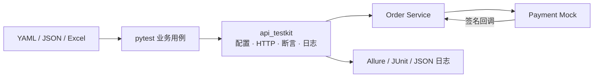

# OrderGuard API Quality Lab

[](https://github.com/xr-susan/orderguard-api-quality-lab/actions/workflows/api-tests.yml)
[](https://github.com/xr-susan/orderguard-api-quality-lab/actions/workflows/quality.yml)
[](LICENSE)
[](pyproject.toml)

一个Python 接口自动化测试项目。它不是只对公开 API 发请求的脚本集合，而是把可复用测试框架、真实 HTTP 黑盒测试、可编程依赖 Mock、风险驱动用例和 CI 证据链放在同一个可运行仓库中。

> 业务场景：订单创建 → 库存预占 → 支付依赖调用 → 异步支付回调 → 状态与库存收敛。

## 核心设计

- **分层而非堆脚本**：`api_testkit` 与业务用例、服务实现解耦；配置、HTTP、认证、断言、数据加载、日志与 Allure 集成均有独立边界。
- **数据驱动且有类型约束**：YAML、JSON、Excel 被收敛成同一套 Pydantic 用例模型；格式错误会在执行前失败。
- **可控依赖故障**：支付 Mock 可注入 429、503、超时、延迟/重复回调、错误签名，并提供请求历史作为断言证据。
- **测试的是风险**：覆盖幂等、库存回滚、重试边界、伪造回调、契约漂移与敏感信息脱敏。
- **可交付的工程闭环**：GitHub Actions 分开执行质量门禁、Docker 黑盒测试和 Allure 报告归档/发布。

## 架构



依赖规则：`src/api_testkit` 不包含任何订单领域概念；`tests/support` 封装领域客户端；`tests/cases` 只描述业务意图；黑盒用例不导入服务内部 ORM 或 Schema。

## 技术栈

| 范畴 | 选择 |
| --- | --- |
| 语言与测试 | Python 3.12–3.14、pytest、coverage |
| HTTP 与重试 | httpx、tenacity、基于方法安全性与总预算的重试策略 |
| 配置与数据 | Pydantic Settings、PyYAML、openpyxl |
| 演示系统 | FastAPI、SQLAlchemy、SQLite、JWT、HMAC |
| 报告与质量 | Allure、JUnit XML、Ruff、mypy |
| 交付 | Docker Compose、GitHub Actions、GitHub Pages |

## 快速开始

前置条件：Python 3.12+，推荐安装 [uv](https://docs.astral.sh/uv/)。Docker 路径还需要 Docker Desktop。

```bash
uv sync --all-extras
docker compose up --build --wait
uv run pytest tests/cases -m "not external" --alluredir=allure-results
docker compose down --volumes
```

也可以分别运行质量门禁与框架单测：

```bash
uv run ruff check .
uv run mypy src/api_testkit
uv run coverage run -m pytest tests/framework_unit
uv run coverage report --show-missing
```

首次在可联网环境执行 `uv lock` 后，请将生成的 `uv.lock` 提交；CI 当前使用 `uv sync --all-extras`，确保新克隆仓库也能直接解析并安装依赖。

## 目录结构

```text
src/api_testkit/          # 可复用框架：config/http/data/assertions/observability
services/order_service/   # 被测订单服务：库存、幂等、支付编排、回调验签
services/payment_mock/    # 可编程支付依赖：故障注入与请求历史
tests/framework_unit/     # 框架单测（MockTransport，无外部服务）
tests/cases/              # 黑盒：smoke/functional/contract/resilience/security
tests/data/               # YAML、JSON、Excel 数据驱动用例
tests/support/            # 领域客户端、环境和断言
config/                   # base/local/ci 分层配置
.github/workflows/        # 质量门禁、E2E、报告归档与 Pages 发布
docs/                     # 架构、测试策略、ADR
```

## 用例与能力映射

| 分层 | 示例 | 证明的能力 |
| --- | --- | --- |
| Smoke | 订单创建并支付成功 | 最小业务链路可用 |
| Functional | YAML/JSON/Excel 数据用例 | 统一数据模型与参数化执行 |
| Contract | 独立 JSON Schema 校验订单响应 | 防止接口响应漂移 |
| Resilience | 503、429、超时与库存释放 | 有界重试、退避、失败补偿 |
| Security | JWT、所有权、HMAC 伪造回调 | 鉴权与 Webhook 安全 |

支付 Mock 的控制面示例：

```bash
curl -X POST http://localhost:8001/__admin/scenarios \
  -H "Content-Type: application/json" \
  -d '{"merchant_order_no":"ORD-001","behavior":"unavailable","fail_times":2}'
```

该配置会让前两次支付尝试返回 503，第三次恢复；测试再从 `/__admin/requests/{merchant_order_no}` 校验真实调用次数。

## 重试与异常处理原则

- 只对 429、502、503、504 和明确的传输异常进行重试。
- 默认仅重试安全方法；`POST` 需要携带 `Idempotency-Key` 才能重放。
- 支付服务自身最多 3 次尝试，记录每一次状态、耗时和可重试性；耗尽后返回明确业务错误并释放库存。
- 黑盒测试执行器禁用自动重放，以便观察接口的**第一次**响应；重试行为由专门的韧性用例验证。
- 请求、响应和日志中的认证信息会脱敏；Allure 附件保留可排查证据。

## CI/CD

- `quality.yml`：PR 与主分支执行 Ruff、mypy、框架覆盖率。
- `api-tests.yml`：Docker Compose 启动两项服务；PR 运行 smoke，主分支/定时任务运行完整黑盒套件。
- 每次执行上传 Allure 原始结果、JUnit XML 和服务日志；主分支成功后生成 HTML 报告并发布到 GitHub Pages（需在仓库 Settings → Pages 中选择 **GitHub Actions**）。


## 进一步阅读

- [架构说明](docs/architecture.md)
- [风险驱动测试策略](docs/test-strategy.md)
- [架构决策记录](docs/adr)

## 路线图

- PostgreSQL 与并发库存竞争场景
- Allure 历史趋势与跨构建报告
- Pact/consumer-driven contract testing
- 真实第三方沙箱环境的可选、隔离测试

## License

MIT
