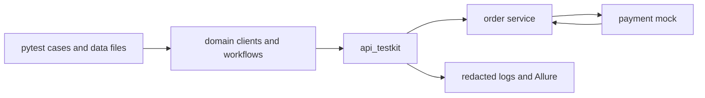

# Architecture

OrderGuard separates the reusable test toolkit, domain-specific test support,
and the two demo services. The black-box suite communicates with services only
through HTTP and independently maintained schemas.

## Dependency rules

1. `src/api_testkit` contains no order, product, or payment concepts.
2. `tests/support` may depend on `api_testkit`, never the other way around.
3. `tests/cases` stay thin and express business intent.
4. Black-box tests never import service ORM or Pydantic models.
5. Test-side JSON Schemas are stored independently from FastAPI models.

## Test layers

- Framework unit tests use `httpx.MockTransport` and no live service.
- Service unit tests verify each demo service in isolation.
- Black-box API tests run both services through Docker Compose and real HTTP.

## Scope boundary

Version 1 uses SQLite and a deliberately small order workflow. PostgreSQL,
high-contention inventory tests, parallel execution, and cross-build Allure
history are roadmap items rather than hidden partial features.

