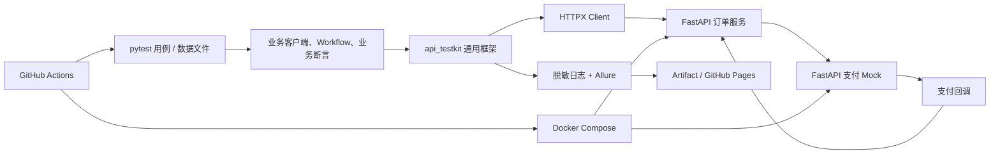

# OrderGuard API Quality Lab 项目设计方案

> 状态：设计已确认，尚未开始编码  
> 方向：Python 测试开发  
> 主测试目标：自建 FastAPI 订单系统 + 独立可编程支付 Mock 服务

## 1. 项目定位

仓库名建议：`orderguard-api-quality-lab`

一句话定位：围绕订单—支付链路，展示数据驱动、依赖故障注入、幂等与重试验证、可诊断报告以及 CI 质量门禁的 Python API 质量工程项目。

项目重点不是“重新包装 pytest”，而是证明下面这些能力：

- 能按职责和依赖方向设计测试框架；
- 能把业务风险转化为接口场景，而不只断言状态码；
- 能控制外部依赖并稳定复现超时、限流和服务异常；
- 能区分安全重试与可能产生重复副作用的危险重试；
- 能让失败在 Allure、日志和 CI 中快速定位；
- 能把项目做成其他人可以一键复现的开源作品。

## 2. 技术栈决策

| 领域 | 选型 | 项目中的职责 |
|---|---|---|
| 语言 | Python `>=3.12,<3.15` | 主 CI 使用 3.13；框架单测验证 3.12、3.13、3.14，只有 CI 通过后才声明兼容 |
| 依赖管理 | uv + PEP 621 `pyproject.toml` + `uv.lock` | 可重复安装；CI 执行 `uv sync --locked` |
| 测试执行 | pytest | fixture、marker、参数化、插件钩子和测试收集 |
| HTTP 客户端 | HTTPX | 连接池、细粒度超时、事件钩子、可注入 transport；v1 默认同步 Client |
| 配置模型 | Pydantic Settings | 类型化环境配置、环境变量覆盖、配置启动即校验 |
| 用例模型 | Pydantic | YAML、JSON、Excel 全部转成统一 `CaseSpec` |
| 数据解析 | PyYAML、标准库 json、openpyxl | YAML 为主格式；JSON/Excel 是兼容适配器 |
| 契约校验 | jsonschema | 校验独立保存的响应 JSON Schema，不复用被测服务模型 |
| 重试 | Tenacity | 受控的停止条件、退避、抖动、状态码和异常过滤 |
| 日志 | 标准库 logging + contextvars | 结构化字段、关联 ID、敏感信息脱敏；不额外堆日志框架 |
| 报告 | allure-pytest + 固定版本 Allure CLI | 步骤、附件、分类、环境信息和重试轨迹 |
| 被测系统 | FastAPI + SQLite | 只实现订单链路必需的最小业务；v1 不做完整商城 |
| Mock 服务 | 独立 FastAPI 服务 | 支付业务接口、故障控制接口和调用记录 |
| 运行环境 | Docker Compose | 订单服务和支付 Mock 一键启动、健康检查和隔离网络 |
| 工程质量 | Ruff、mypy、coverage | 格式/静态检查、类型检查、框架核心覆盖率门禁 |
| CI/CD | GitHub Actions + GitHub Pages | PR 分层测试、构建报告、上传 artifacts、主分支发布在线报告 |

版本策略：在 `pyproject.toml` 声明兼容范围，在 `uv.lock` 锁定可复现版本；依赖升级由单独 PR 完成。CI Action 和 uv 也固定稳定版本或提交 SHA，不使用浮动的 `latest`。

为什么选择 HTTPX 而不是 Requests：HTTPX Client 支持连接池、统一配置、细粒度 connect/read/write/pool timeout，以及可注入 transport。框架先使用同步模式，只有确实需要并发场景时才局部引入异步，避免为了“高级感”全面 async。

## 3. 测试目标与两种方案比较

| 维度 | 公开真实 API | 自建 FastAPI 系统 |
|---|---|---|
| 启动成本 | 低，马上可以写请求 | 需要先实现最小业务系统 |
| CI 稳定性 | 受限流、网络和数据变化影响 | 可完全控制和重置 |
| 故障注入 | 很难稳定制造超时、429、503、重复回调 | 可按用例精确配置 |
| 数据隔离 | 通常不能清库或重置 | 可按 run/case 隔离数据 |
| 进阶展示 | 容易停留在调用和断言 | 可展示状态机、幂等、补偿、契约和依赖治理 |
| 主要风险 | 外部不稳定造成 flaky | 容易把精力花成后端开发项目 |

最终决策：自建 FastAPI 系统作为主目标；公开 API 只作为 `external` 标记的可选定时 smoke，不进入 PR 必过门禁。

FastAPI 比 Flask 更适合这个作品，因为可以低成本生成 OpenAPI、使用强类型请求模型，并自然实现回调接口。Express 可以体现跨语言，但会扩大范围，对当前 Python 测试开发目标收益不高。

### 3.1 订单系统范围

只实现 6 个核心接口：

1. `POST /auth/token`：获取访问令牌；
2. `GET /products`：查询商品及可用库存；
3. `POST /orders`：创建订单，要求 `Idempotency-Key`；
4. `POST /orders/{order_id}/pay`：发起支付；
5. `GET /orders/{order_id}`：查询订单状态；
6. `POST /payments/callback`：处理带 HMAC 签名的支付回调。

核心状态流转：

```text
CREATED -> PAYING -> PAID
                   -> PAYMENT_FAILED（释放预留库存）
```

不做后台 UI、商品管理、复杂角色权限、优惠券、物流等非核心功能。

### 3.2 支付 Mock 服务

支付 Mock 同时提供业务面与控制面：

- 业务面：创建支付、查询支付、发送回调；
- 控制面：注册场景、清理场景、查询收到的请求与调用次数；
- 场景按测试生成的 `merchant_order_no` 或幂等键隔离，不使用全局“当前故障模式”；
- 至少支持成功、超时、429 + `Retry-After`、503、延迟回调、重复回调、非法签名六类行为。

测试不仅验证订单服务的最终响应，还要验证 Mock 实际收到的请求体、签名、幂等键和调用次数。

## 4. 总体架构



依赖规则：

- `src/api_testkit` 不得出现 order、product、payment 等领域概念；
- 业务客户端和 workflow 只能依赖通用框架；
- 黑盒接口测试不得导入订单服务的 ORM、Pydantic 模型、状态枚举或内部函数；
- 接口 Schema 在测试侧独立保存，避免实现和测试“错在一起”；
- 复杂链路用 Python 表达，数据文件不发展成编程语言。

## 5. 框架分层设计

### 5.1 配置层

`Settings` 使用 Pydantic Settings，建议优先级：

```text
代码默认值 < config/base.yaml < config/{env}.yaml < 环境变量 < pytest CLI 参数
```

配置包括 base URL、超时、重试预算、日志级别和报告目录。Token、密码、签名密钥只从环境变量/GitHub Secrets 读取，不写入 YAML。

### 5.2 HTTP 请求层

`ApiClient` 采用组合而非继承，内部持有 `httpx.Client`，负责：

- base URL、连接池和四类 timeout；
- Token 注入、`X-Request-ID`/`X-Case-ID` 关联标识；
- 请求/响应耗时、脱敏日志和 Allure 附件；
- transport 注入，方便框架自身单元测试；
- 将网络异常转换为保留原异常链的框架异常。

不要包装 HTTPX 的全部方法，也不要默认对每个响应调用 `raise_for_status()`；400/409 等状态本身可能就是负向测试的正确结果。

### 5.3 业务访问层

`AuthClient`、`ProductClient`、`OrderClient` 只封装业务端点和参数。`OrderWorkflow` 编排登录、下单、支付、轮询状态等链路。测试函数保持 Given/When/Then 风格，不直接拼 URL、Token 或重试循环。

### 5.4 数据驱动层

三个 loader 全部输出同一个强类型模型：

```text
CaseSpec
├─ id / name / markers
├─ request: method / path / headers / query / json
├─ expected: status / headers / json_contains / schema
└─ source: file / sheet / row
```

- YAML：规范主格式，适合嵌套请求和期望；必须使用 `safe_load`；
- JSON：证明结构化输入兼容性；
- Excel：只承载扁平边界参数，复杂单元格使用 JSON 字符串；不支持公式、跨 Sheet 流程；
- 使用 `pytest_generate_tests` 在收集阶段生成参数并校验；非法数据应在发送请求前失败；
- 错误信息定位到文件、Sheet、行、字段和 case id；
- 仅支持白名单变量替换，不使用 `eval`、任意 Jinja 表达式或动态 Python；
- 三种格式只展示同一执行链路，不复制三套相同用例。

### 5.5 断言层

保留 pytest 普通 `assert`，只提供有诊断价值的小型助手：

- 状态码、响应头和响应时间；
- JSON 子集/路径值；
- JSON Schema；
- 业务断言，例如支付失败后库存已释放、重复回调只改变一次状态。

断言失败需要显示 case id、数据源位置、期望/实际差异、关联 ID，并把脱敏后的请求和响应附到 Allure。不要自造通用断言 DSL。

### 5.6 异常层

建议异常分类：

- `ConfigurationError`：配置缺失或类型错误；
- `CaseDataError`：用例数据无法解析或校验；
- `ApiTransportError`：连接、超时、协议等网络错误；
- `AuthenticationError`：Token 获取/刷新失败；
- `ContractValidationError`：响应不符合 Schema；
- `MockControlError`：故障注入或 Mock 清理失败。

所有转换使用异常链；清理异常不能覆盖原始测试失败；业务断言失败继续由 pytest 清晰展示。

### 5.7 重试与轮询

自动重试发生在“发送单次 HTTP 请求”的边界，而不是重跑整个 pytest 用例：

- 默认候选：连接异常、超时、429、502、503、504；
- 尊重 `Retry-After`，否则指数退避 + 抖动；
- 同时限制最大次数与总时间预算；
- GET/HEAD 可按策略重试；POST 只有携带幂等键且服务端明确实现幂等时才允许；
- 普通 4xx、Schema 失败和业务断言失败永不重试；
- 每次尝试都记录状态、异常、耗时和等待时间；
- 不把 `pytest-rerunfailures` 设为默认门禁，避免掩盖 flaky 和真实缺陷。

最终一致性使用独立的 deadline polling 等待订单状态，避免固定 `sleep`，并与网络请求重试区分语义。

### 5.8 日志与报告

每条请求记录 `run_id`、`case_id`、`request_id`、方法、路径、状态、耗时和重试序号。必须脱敏 Authorization、Cookie、密码、Token、签名和支付字段，并限制大响应附件大小。

Allure 中至少展示：

- feature/story/severity 与稳定的 case id；
- Given/When/Then 步骤；
- 脱敏请求、响应、关联 ID、数据源位置；
- 每次重试轨迹和 Mock 调用记录；
- `categories.json` 对配置、数据、网络、契约和业务断言失败分类。

## 6. 用例组合

v1 目标是 20～30 个独立高价值场景，而不是用参数行数制造“几百条用例”。建议分组：

| 套件 | 代表场景 |
|---|---|
| smoke | 登录、商品查询、创建订单、支付成功、查询订单 |
| functional | 缺字段、非法数量、库存不足、非法状态流转、越权查询 |
| contract | OpenAPI/JSON Schema 漂移、字段类型、必填字段 |
| resilience | 超时、429、503、延迟回调、重试预算耗尽 |
| idempotency | 重复创建订单、重复发起支付、重复回调 |
| security-lite | 缺失/过期 Token、非法回调签名、日志脱敏 |
| framework_unit | 配置优先级、loader 一致性、错误定位、重试判断、脱敏规则 |

最能体现进阶能力的一条用例应验证：首次支付超时、后续成功时，只产生一笔支付和一笔订单；调用次数符合策略；订单最终为 PAID；库存只扣减一次；Allure 能看到完整重试轨迹。

## 7. 推荐目录结构

```text
orderguard-api-quality-lab/
├─ README.md
├─ pyproject.toml
├─ uv.lock
├─ compose.yaml
├─ .env.example
├─ config/
│  ├─ base.yaml
│  ├─ local.yaml
│  └─ ci.yaml
├─ src/
│  └─ api_testkit/
│     ├─ config/
│     │  ├─ models.py
│     │  └─ sources.py
│     ├─ http/
│     │  ├─ client.py
│     │  ├─ auth.py
│     │  ├─ retry.py
│     │  └─ hooks.py
│     ├─ data/
│     │  ├─ models.py
│     │  ├─ base.py
│     │  ├─ yaml_loader.py
│     │  ├─ json_loader.py
│     │  └─ excel_loader.py
│     ├─ assertions/
│     │  ├─ response.py
│     │  └─ schema.py
│     ├─ observability/
│     │  ├─ logging.py
│     │  ├─ redaction.py
│     │  └─ allure_adapter.py
│     ├─ errors.py
│     └─ pytest_plugin.py
├─ services/
│  ├─ order_service/
│  │  ├─ app/
│  │  ├─ tests/
│  │  └─ Dockerfile
│  └─ payment_mock/
│     ├─ app/
│     │  ├─ payment_api.py
│     │  ├─ control_api.py
│     │  └─ scenario_store.py
│     ├─ tests/
│     └─ Dockerfile
├─ tests/
│  ├─ conftest.py
│  ├─ framework_unit/
│  ├─ support/
│  │  ├─ clients/
│  │  ├─ workflows/
│  │  ├─ assertions/
│  │  └─ factories/
│  ├─ cases/
│  │  ├─ smoke/
│  │  ├─ functional/
│  │  ├─ contract/
│  │  ├─ resilience/
│  │  └─ security/
│  ├─ data/
│  │  ├─ yaml/
│  │  ├─ json/
│  │  └─ excel/
│  └─ schemas/
├─ reporting/
│  └─ categories.json
├─ docs/
│  ├─ architecture.md
│  ├─ test-strategy.md
│  └─ adr/
│     ├─ 001-httpx-over-requests.md
│     ├─ 002-idempotency-aware-retry.md
│     └─ 003-yaml-as-primary-format.md
└─ .github/
   └─ workflows/
      ├─ quality.yml
      ├─ api-tests.yml
      └─ pages.yml
```

## 8. GitHub Actions 设计

### PR

1. `quality`：Ruff、mypy、lockfile 校验；
2. `framework-unit`：框架单元测试和核心覆盖率门禁；
3. `smoke-e2e`：Compose 启动、健康检查、数据初始化、黑盒 smoke；
4. `report`：无论成功失败都生成/上传 Allure 结果、JUnit XML 和服务日志；
5. 任一门禁失败都阻止合并，PR 不发布 GitHub Pages。

### main / 手动 / 定时任务

- `main`：运行完整 functional、contract、resilience、idempotency 套件；发布当前 Allure 到 Pages；
- `workflow_dispatch`：允许选择环境和 marker；
- `schedule`：完整回归，可附加非阻塞的 `external` smoke；
- 使用 `concurrency` 取消同一 PR 的旧运行，设置 job 超时和最小权限；
- 测试失败时仍执行报告上传，但测试 job 的最终状态必须保持失败。

## 9. README 结构

面试官打开仓库后的前 60 秒应该看到：

1. 项目名和一句话价值定位；
2. CI、Python、License 徽章以及在线 Allure 链接；
3. 一张架构图或 60～90 秒演示 GIF；
4. 四个核心亮点，每个都附代码、报告或 workflow 证据链接；
5. 风险—场景—验证点矩阵；
6. 三到五条命令完成安装、启动和 smoke；
7. 精简目录说明与分层依赖规则；
8. 数据驱动示例，说明三种 loader 如何进入同一 `CaseSpec`；
9. Mock 故障注入示例以及如何断言调用次数；
10. 重试白名单、幂等条件和为什么不全局重跑；
11. CI 在 PR、main、schedule 分别执行什么；
12. 实测指标、已知限制、路线图、贡献指南和 License。

README 中的数字必须由项目实际结果生成。建议完成后再填写：独立场景数、框架覆盖率、PR/全量耗时、连续运行次数、故障模式数和 flaky 次数，不能提前编造。

## 10. 开发计划与工时

按业余时间每周 9～12 小时计算：MVP 约 3 周；适合公开展示的 v1.0 建议 5 周，总计约 45～60 小时。

### 第 1 周：业务风险与可复现环境

- 明确接口契约、订单状态机和风险清单；
- 实现 6 个最小业务接口；
- 实现支付 Mock 的成功、超时、503 和控制/调用记录接口；
- 完成 Compose、健康检查、种子数据和仅测试环境可用的 reset；
- 写 2～3 个 ADR。

验收：新环境可启动；happy path 和一个支付失败路径可通过纯 HTTP 跑通；黑盒测试不导入服务内部模型。

### 第 2 周：框架核心

- 配置优先级和启动校验；
- HTTPX Client、认证、timeout、关联 ID；
- 异常分类、脱敏日志和基础 Allure 附件；
- pytest fixtures、marker、健康检查和数据工厂；
- 编写框架单元测试及 8～10 个 smoke/functional 场景。

验收：网络/配置失败可清楚定位；日志无敏感值；框架核心已有阶段覆盖率。

### 第 3 周：数据驱动、契约和报告

- 实现 `CaseSpec` 和 YAML/JSON/Excel adapters；
- 收集阶段校验和精确错误定位；
- 状态码、JSON 子集、Header、JSON Schema 断言；
- Allure 元数据、步骤、附件和失败分类；
- 场景总数达到约 18～20 个。

验收：三种格式的等价输入生成同一模型；非法文件在请求前失败；报告可独立支持定位。

### 第 4 周：依赖故障、幂等与 CI

- 补齐 429、延迟/重复回调和非法签名；
- 实现幂等感知重试、`Retry-After`、指数退避和总预算；
- 验证 Mock 调用次数、无重复订单/支付和库存补偿；
- 完成 GitHub Actions 的 quality、unit、smoke、full、report jobs；
- 场景总数达到 20～30 个。

验收：至少 6 类故障可稳定复现；重试条件、次数和副作用均被断言；失败真正阻止 CI。

### 第 5 周：可靠性与作品集包装

- 核心套件连续执行 20 次，记录实际 flaky 结果；
- 将框架核心覆盖率目标提升到约 85%；
- 优化冷启动和 PR 时长；
- 发布 Allure Pages，完善 README、架构图、演示 GIF、Issue/Milestone；
- 全新环境按 README 复跑，打 `v1.0.0` 标签。

验收：一名不了解项目的人可按 README 独立启动；README 首屏一分钟内能看懂价值；仓库不含密钥、缓存或生成报告垃圾。

## 11. v1 Definition of Done

- 一组明确命令可以安装依赖、启动服务并执行 smoke；
- 黑盒套件不导入被测服务内部模型；
- 20～30 个独立高价值场景覆盖正常、负向、契约、幂等和依赖故障；
- 三种数据格式统一为 `CaseSpec`，错误定位到具体来源；
- 重试专项用例证明调用次数正确且没有重复副作用；
- 所有日志和报告附件完成敏感信息脱敏；
- 框架核心单元测试覆盖率目标约 85%，与示例服务覆盖率分开披露；
- 核心套件连续运行 20 次并公开真实结果；
- PR 门禁建议控制在 5 分钟以内，以实测数字为准；
- CI 失败保留诊断 artifacts，主分支发布 Allure Pages。

## 12. 延期到 v1.1/v2

- PostgreSQL 和真实高并发库存竞争；
- pytest-xdist 并行执行；
- Allure 跨构建历史趋势；
- Schemathesis/OpenAPI 生成式测试；
- 性能或混沌测试；
- 独立发布 PyPI 包；
- Mock 可视化管理 UI；
- Excel 公式、跨 Sheet 流程或复杂模板语言。

这些能力可以成为后续 Issue，但不应阻塞 v1.0。项目的高级感来自风险建模、隔离性、幂等边界、诊断证据和可重复 CI，而不是依赖数量。

## 13. 官方参考

- [Python 版本状态](https://devguide.python.org/versions/)
- [pytest 参数化](https://docs.pytest.org/en/stable/how-to/parametrize.html)与 [fixture](https://docs.pytest.org/en/stable/explanation/fixtures.html)
- [HTTPX Client](https://www.python-httpx.org/advanced/clients/)、[Timeouts](https://www.python-httpx.org/advanced/timeouts/)与 [Transports](https://www.python-httpx.org/advanced/transports/)
- [Pydantic Settings](https://docs.pydantic.dev/latest/concepts/pydantic_settings/)
- [Tenacity](https://tenacity.readthedocs.io/en/latest/)
- [FastAPI 测试](https://fastapi.tiangolo.com/tutorial/testing/)
- [Allure Pytest](https://allurereport.org/docs/pytest/)
- [GitHub Actions Python](https://docs.github.com/en/actions/tutorials/build-and-test-code/python)、[Artifacts](https://docs.github.com/en/actions/tutorials/store-and-share-data)与 [Pages](https://docs.github.com/en/pages/getting-started-with-github-pages/using-custom-workflows-with-github-pages)
- [uv 锁定与同步](https://docs.astral.sh/uv/concepts/projects/sync/)及 [GitHub Actions 集成](https://docs.astral.sh/uv/guides/integration/github/)
